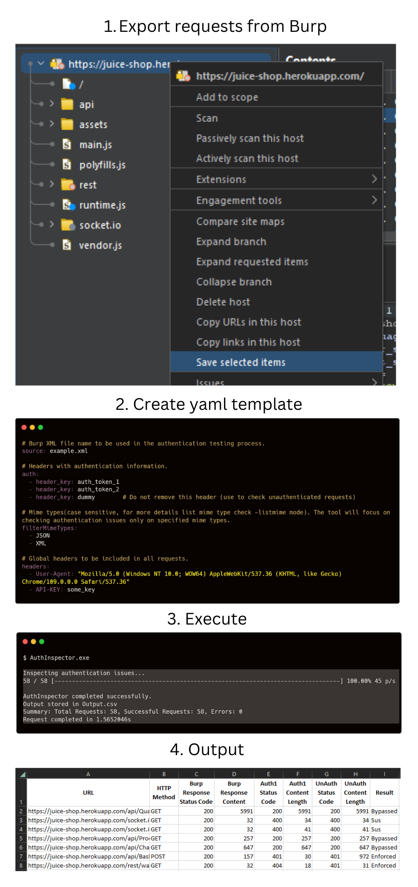

# AuthInspector

[](http://www.apache.org/licenses/) 
[](https://twitter.com/karma9874)
[](https://github.com/karma9874)

AuthInspector is a Golang tool designed for hassle-free authorization and authentication checks. By extracting request details from BurpSuite export, it performs thorough authorization checks based on user-provided headers for each request with Goroutines in place for speedy processing, and provides results in a simple CSV file with all details.

# Work flow
<h3 align="center">
  </a>
</h3>


# Installation

**Easy Installation**: You can download the prebuilt binary from the [releases](https://github.com/karma9874/AuthInspector/releases) page.

**Go Install**: `go install github.com/karma9874/AuthInspector@latest`

**Go Build**: `go get && go build`

# Usage

1. Begin by capturing web requests using the high-level account.
2. Once your website browsing is complete, export the requests by navigating to `Target -> Site map -> selecting the URL -> Right Click and Save Selected Item`.
3. Create an init.yaml file with the following configurations:
    * `source:` Specify the name of the exported file from the previous step (Compulsory).
    * `auth:` Define the header responsible for authentication (e.g., Cookie, Authorization header, custom) (Compulsory).
    * `filterMimeType:` Include requests containing the specified MIME type (Compulsory).
    * `headers:` Optionally provide global headers, influencing requests containing this header (Optional).

AuthInspector provides the following commands for customization:
```bash
-proxy    Set up a proxy for testing.
-respBody Include response body in the output
-reqBody  Include request body in the output.
-timeout  Set the timeout for requests.
-threads  Specify the number of concurrent threads.
-listmime Lists the available mimetypes from the burp exported file
-verbose  Verbose output
```

**Running AuthInspector**

```bash 
AuthInspector -proxy http://proxy.example.com -respBody -reqBody -time 5s -threads 20
```

**Config Template**
```yaml
# Burp XML file name to be used in the authentication testing process.
source: example.xml

# Headers with authentication information.
auth:
  - header_key: header_value
  - header_key: header_value
  - dummy_header: dummy_value  # Do not remove this header (use to check unauthenticated requests)

# Mime types(case sensitive, for more details list mime type check -listmime mode). The tool will focus on checking authentication issues only on specified mime types.
filterMimeTypes:
  - JSON
  - XML

# Global headers to be included in all requests.
headers:
  - User-Agent: "Mozilla/5.0 (Windows NT 10.0; WOW64) AppleWebKit/537.36 (KHTML, like Gecko) Chrome/109.0.0.0 Safari/537.36"
  - API-KEY: some_key
```
